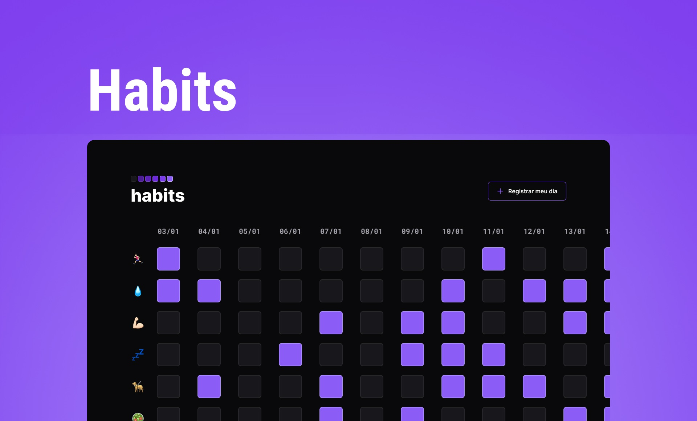

<h1 align="center"> Habits </h1>

  <a href="#-projeto">Projeto</a>&nbsp;&nbsp;&nbsp;|&nbsp;&nbsp;&nbsp;
  <a href="#-tecnologias">Tecnologias</a>&nbsp;&nbsp;&nbsp;|&nbsp;&nbsp;&nbsp;
  <a href="#-layout">Layout</a>&nbsp;&nbsp;&nbsp;|&nbsp;&nbsp;&nbsp;
  <a href="#memo-licença">Licença</a>

  

 

  

## 💻 Projeto

O Habits é um app para ajudar a rastrear hábitos saudáveis que você deseje praticar.
 
Baseado no projeto desenvolvido no bootcamp NLW 11(Next Level Week), evento online de programação na prática da escola Rocketseat.

- Clique [aqui e acesse o app online](https://dzzanis.github.io/habits)

## 🚀 Tecnologias

Esse projeto foi desenvolvido com as seguintes tecnologias:

- HTML e CSS
- JavaScript
- Git e Github
- Figma

## 🔖 Layout

Você pode visualizar o layout do projeto através [DESSE LINK](https://www.figma.com/community/file/1195327109778210238). É necessário ter conta no [Figma](https://figma.com) para acessá-lo.

## :memo: Licença

Esse projeto está sob a licença MIT.

---

Feito com ♥ by Diogo Zanis :wave: [LinkedIn](https://www.linkedin.com/in/diogo-zanis-51539a121)
